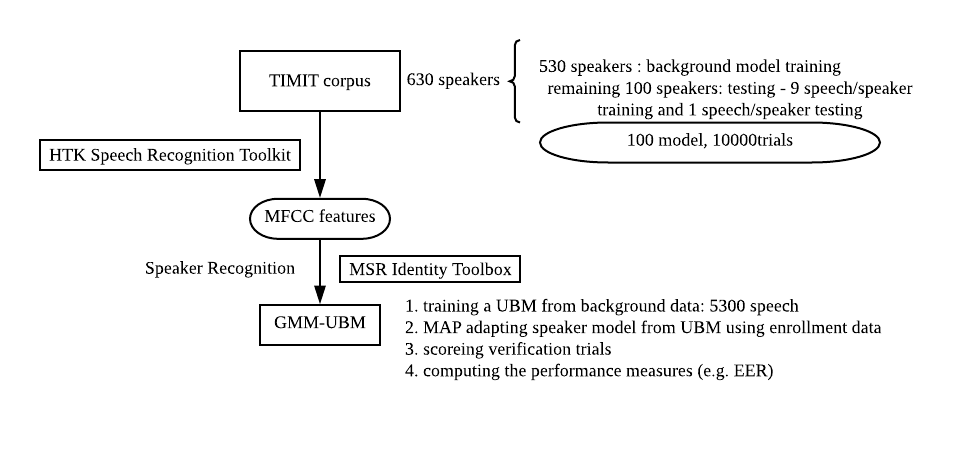

# Speaker-Recognition-GMM-UBM

     


<p align="center">
	<a href="./docs/matlab-common-operations.md">Common Matlab operations</a>&nbsp;&nbsp;&nbsp;
	<a href="./docs/matlab-functions-you-will-encounter.md">Matlab Functions Used</a>&nbsp;&nbsp;&nbsp;
	<a href="./docs/GMM-UBM-speaker-model.md">GMM-UBM speaker model</a>&nbsp;&nbsp;&nbsp;
	<a href="./docs/HTK-Tutorial.md">HTK Tutorial</a>&nbsp;&nbsp;&nbsp;
	<a href="./docs/MSR-Identity-Toolkit.md">MSR-Identity-Toolkit</a>
</p>

## Contents

1. [Transform WAV To Readable file](#transform-wav-to-readable-file)


### 1. Transform WAV To Readable file

1. Download TIMIT corpus.

2. Create a file (copy TIMIT's two files in it：(1)TEST (2)TRAIN)which has the same directory form as TIMIT corpus：
<font color=800080 size=3>**main.py**</font>
   
   ```python
   import os, sys
   
   # path1 = 'D:/Project/Speaker-Recognition/timit_wav8000'
   # path1 = 'D:/Project/Speaker-Recognition/timit_mfcc'
   path1 = 'D:/Project/Speaker-Recognition/timit_wav16000'
   print(f'the path to be deleted is {path1}')
   files1 = os.listdir(path1)
   count = 0
   for file1 in files1:
       path2 = path1 + '/' + file1
       files2 = os.listdir(path2)
   
       for file2 in files2:
           path3 = path2 + '/' + file2
           files3 = os.listdir(path3)
           for file3 in files3:
               path4 = path3 + '/' + file3
               files4 = os.listdir(path4)
               for file4 in files4:
                   path5 = path4 + '/' + file4
                   # print(path5)
                   count += 1
                   os.unlink(path5)
   print(count)
   print('complete delete')
```
   
3. Transform WAV to readable files and save in the above file：

   <font color=800080 size=3>**conver_wav.m(入口函数)**</font>

   ```matlab
   path1 = 'D:\Project\Speaker-Recognition\TIMIT';
   path2 = 'D:\Project\Speaker-Recognition\timit_wav16000';
   len1 = length(path1); % 36
   wav_filesName = find_wav(path1);
   % wav_filesName(1,:) is 'D:\Project\Speaker-Recognition\TIMIT\TEST\DR1\FAKS0\SA1.WAV'
   % p1 = strfind(wav_filesName(1,:),'.W') % 56
   % wav_filesName(1,37:56+3) % is '\TEST\DR1\FAKS0\SA1.WAV'
   [m,n] = size(wav_filesName);
   
   % 保存wav文件名，添加人名前缀
   tic
   hwt = waitbar(0,'please wait....');
   for i = 1:m
       [x,fs] = audioread(wav_filesName(i,:));
       p = strfind(wav_filesName(i,:),'.W'); 
       writefileName = [path2,wav_filesName(i,len1+1:p+3)];
   	audiowrite(writefileName,x,fs);
       % y = resample(x,1,2);
       % p = strfind(wav_filesName(i,:),'.W'); 
       % writefileName = [path2,wav_filesName(i,len1+1:p+3)];
       % audiowrite(writefileName,y,8000);
       waitbar(i/m);
   end
   close(hwt);
   toc
   ```

   <font color=800080 size=3>**find_wav.m**</font>

   ```matlab
   function [ wav_files ] = find_wav( path )
     %FIND_WAV, find all wav file recursively
     wav_files = [];
     if(isdir(path) == 0) % is path is not a folder, is a file, then return 
         return;
     end
     path_files = dir(path); % path is the folder content of path
     fileNum = length(path_files);
     for k= 3:fileNum
         file = [path,'\', path_files(k).name];
   %       disp(sprintf('file is %s',file));
       if (path_files(k).isdir == 1)
           ret = find_wav(file); % if path_files is a folder, do the find_wav function to the input(file)
   %         disp(sprintf('ret is %s',ret));
           if(isempty(ret) ~= 1)
   %             disp(sprintf('ret is %s',ret));
               if(isempty(wav_files))
   %                 disp(sprintf('ret is %s',ret));
                   wav_files = char(ret);
   %                 disp(sprintf('wav_files is %s',wav_files));
               else
                   wav_files = char(wav_files, ret);
               end
           end
       elseif strfind(path_files(k).name, '.WAV')
           if(isempty(wav_files))
               wav_files = char(file);
           else
               wav_files = char(wav_files, file);
           end
       end
     end
   end
   ```

   <font color=800080 size=3>**check_wav.m**</font>

   ```matlab
   %clear all;
   %files = find_wav('D:\D\Speaker-Recognition\timit_wav8000');
   path2 = 'D:\Project\Speaker-Recognition\timit_wav8000';
   files = find_wav(path2);
   tic
   hwt = waitbar(0,'please wait....');
   for fileIdx = 1:length(files)
       file = files(fileIdx,:);
       [y, fs] = audioread(file);
       if(fs~=8000)
           fprintf('%s: fs~=8000\n', file);
       end
       waitbar(fileIdx/length(files));
   end
   close(hwt);
   toc
   ```

   

