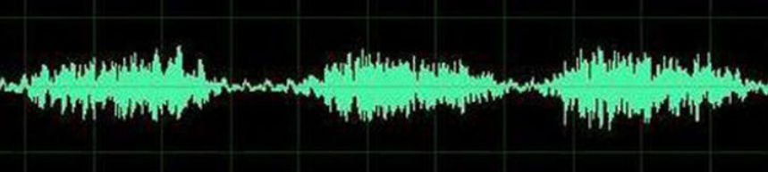
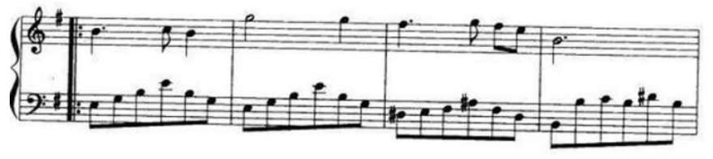
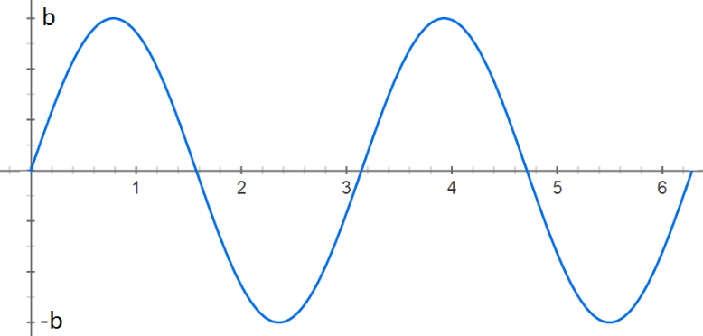

# GMM-UBM-speaker-model

## Content

- [1. 简述说话人识别流程](#简述说话人识别流程)
- [2. 什么是混合高斯模型GMM](#什么是混合高斯模型GMM)
- [3. 什么是通用背景模型UBM](#什么是通用背景模型UBM)
- [4. 什么是最大似然估计](#什么是最大似然估计)
- [5. EM算法](#EM算法)
- [6. GMM-UBM模型](#GMM-UBM模型)
- [7. 基本数学理论](#基本数学理论)
  
  - [7.1 泛化误差](#泛化误差)
  - [7.2 方差](#方差)
  - [7.3 期望](#期望)
- [8. 基本概念](#基本概念)
  - [8.1 TP TN FP FN](#tp-tn-fp-fn)
  - [8.2 数据的标准化和归一化](#数据的标准化和归一化)
  - [8.3 收敛问题](#收敛问题)
- [9. 语音处理基础知识](#语音处理基础知识)
  - [9.1 前置知识](#前置知识)
  - [9.2 梅尔频率倒谱系数MFCC](#梅尔频率倒谱系数)
  - [9.3 理解傅里叶分析](#理解傅里叶分析)

#### 1. 简述说话人识别流程 

1. 特征提取

   预加重、分帧加窗、傅里叶变换得到频谱图、再进行mel滤波使频谱图更紧凑、最后进行倒谱分析(取对数和离散余弦变换)和差分(提供一种动态特征)的到MFCC特征向量。

2. 训练模型

3. 打分判决

#### 2. 什么是混合高斯模型GMM 

1. GMM就是由多个单高斯分布混合而成的一个模型。
2. 为什么要混合：因为单个分布的话拟合能力不够。
3. 为什么要高斯：
   1. 因为高斯分布有很好的计算性质，他有一个自然数e，很自然就可以取对数将乘法变成加法。
   2. 同时高斯分布也有很好的理论支撑,从中心极限定理可知,如果采样最够多的话，n个采样的平均值x拔会符合高斯分布，他的均值就是变量的均值，方差等于变量方差/n，那么只要n足够大，就可以用平均数的高斯分布去近似随机变量的高斯分布。

#### 3. 什么是通用背景模型UBM 

1. UBM相当于一个大的混合高斯分布模型。
2. 目的：为了解决目标用户训练数据太少的问题，用大量非目标用户数据训练出一个拟合通用特征的大型GMM。

#### 4. 什么是最大似然估计 

最大似然估计是一种反推：就是你只已经知道模型了，同时你也有了观测数据，但是模型的参数是未知的，这时候肯定是算不出来准确的参数值的。那就可以把产生当前观测数据的可能性最大的参数当作估计值，这就是最大似然的含义，也就是最大可能性。

#### 5. EM算法 

1. EM算法的关键思想就是迭代求解。
2. 他有两个关键的步骤：期望步和最大化。
   1. 期望：先用上一轮迭代得到的参数计算出隐性变量(无法直接观测到的变量，比如统计身高分布，某个人是男是女无法观测到)的期望。
   2. 最大化：使用最大似然估计和这个期望值来算出新的参数。
      在混合高斯模型中，这个隐性变量实际上是描述数据由那个子高斯分布取样得到的，那他的期望实际上就是被某个子分布生成的概率。

#### 6. GMM-UBM模型 

1. 先使用大量的非目标用户数据训练UBM；
2. 然后使用MAP自适应算法和目标说话人数据来更新局部参数得到对应的GMM；
3. MAP自适应算法相当于先进性一轮EM迭代得到新的参数，然后将新参数和旧参数整合。

#### 7. 基本数学理论 

#### 7.1 泛化误差 

在统计学中, 一个随机变量的方差描述的是它的离散程度, 也就是该随机变量在其期望值附近的**波动程度**。

先从下面的靶心图来对方差与偏差有个直观的感受：

假设红色的靶心区域是学习算法完美的正确预测值, 蓝色点为每个数据集所训练出的模型对样本的预测值, 当我们从靶心逐渐向外移动时, 预测效果逐渐变差。

很容易看出有两副图中蓝色点比较集中, 另外两幅中比较分散, 它们描述的是方差的两种情况.。比较集中的属于**方差**小的, 比较分散的属于**方差大**的情况。

再从蓝色点与红色靶心区域的位置关系, 靠近红色靶心的属于**偏差**较小的情况, 远离靶心的属于**偏差**较大的情况.

不要被上面的公式吓到, 其实不复杂, 在已知结论的情况下, 了解每一项的意义, 就是一个十分简单的证明题而已, 蓝色部分是对上面对应的等价替换, 然后对其展开后, 红色部分刚好为 0.

对最终的推导结果稍作整理:

至此, 继续来看一下偏差, 方差与噪声的含义:

- **偏差**.

  偏差度量了学习算法的期望预测与真实结果的**偏离程度**, 即 刻画了学习算法本身的**拟合能力** .

- **方差**.

  方差度量了同样大小的训练集的变动所导致的**学习性能的变化**, 即刻画了数据扰动所造成的影响 .

- **噪声**.

  噪声表达了在当前任务上任何学习算法所能达到的期望泛化误差的下界, 即刻画了**学习问题本身的难度** . 巧妇难为无米之炊, 给一堆很差的食材, 要想做出一顿美味, 肯定是很有难度的.

想当然地, 我们希望偏差与方差越小越好, 但实际并非如此. 一般来说, 偏差与方差是有冲突的, 称为偏差-方差窘境 (bias-variance dilemma).

- 给定一个学习任务, 在训练初期, 由于训练不足, 学习器的拟合能力不够强, 偏差比较大, 也是由于拟合能力不强, 数据集的扰动也无法使学习器产生显著变化, 也就是欠拟合的情况;

- 随着训练程度的加深, 学习器的拟合能力逐渐增强, 训练数据的扰动也能够渐渐被学习器学到;

- 充分训练后, 学习器的拟合能力已非常强, 训练数据的轻微扰动都会导致学习器发生显著变化, 当训练数据自身的、非全局的特性被学习器学到了, 则将发生过拟合.
  

#### 7.2 方差 

中文名：方差，外文名：variance/deviation Var，类型：统计学，种类：离散型方差、连续型方差。

方差是在概率论和统计方差**衡量**随机变量或一组数据的**离散程度的度量**。概率论中方差用来度量随机变量和其数学期望（即均值）之间的**偏离程度**。统计中的方差（样本方差）是每个样本值与全体样本值的平均数之差的平方值的平均数。

为总体方差，为变量，为总体均值，为总体例数。

#### 7.3 期望 

**期望**：在概率论和统计学中，一个离散性随机变量的**期望值**（或**数学期望**，亦简称**期望**，物理学中称为**期待值**）是试验中每次可能的结果乘以其结果概率的总和。换句话说，期望值像是随机试验在同样的机会下重复多次，所有那些可能状态平均的结果，便基本上等同“期望值”所期望的数。期望值可能与每一个结果都不相等。换句话说，期望值是该变量输出值的加权平均。

例如，掷一枚公平的六面骰子，其每次“点数”的期望值是3.5，计算如下：

不过如上所说明的，3.5虽是“点数”的期望值，但却不属于可能结果中的任一个，没有可能掷出此点数。

赌博是期望值的一种常见应用。

如果是在概率空间中的随机变量，那么它的期望值的定义是：

如果是**离散**的随机变量，输出值为，和输出值相应的概率为（概率和为1）。

#### 8. 基本概念 

#### 8.1 TP TN FP FN 

这几个术语会高频率得出现在实验部分。

- **precesion**：查准率，即在检索后返回的结果中，真正正确的个数占整个结果的比例。
- **recall**：查全率，即在检索结果中真正正确的个数占整个数据集（检索到的和未检索到的）中真正正确个数的比例。
- **TP**：真阳性 True Positive,被判定为正样本，事实上也是正样本。
- **FP**：假阳性 False Positive,被判定为正样本，但事实上是负样本。
- **FN**：假阴性 False Negative,被判定为负样本，但事实上是正样本。
- **TN**：真阴性 True Negative,被判定为负样本，事实上也是负样本。

这里的正样本和负样本与检索的关系就是：你认为为正样本的应该都出现在检索结果中，而你认为为负样本的不应该出现在检索结果中，但是你认为的和事实上的会有不一样。

预测和实际**一致则为真**，预测和实际**不一致则为假**；如果**预测出来是“正”的，则为“阳”**，**预测结果为 “负”，则为“阴”**。

**记忆**：把缩写分为两个部分，第一个字母（F,T）和第二个字母（P,N）。首先搞清楚**第二个字母**，即它是**你认为该**样本的归属应该是怎样（Positive or Negative）；**第一个字母**即是**对你的判断进行的评价**（False or True）。这里也许中文可能会有不好理解的地方，所以我想用英文来描述，可能更清晰：第二个字母：What's your judgement about the sample?；第一个字母：Is your judgement right(true) or not(false)?

那么有：

- precesion = TP/(TP+FP)即，检索结果中，都是你认为应该为正的样本（第二个字母都是P），但是其中有你判断正确的和判断错误的（第一个字母有T ，F）。

- recall = TP/(TP+FN)即，检索结果中，你判断为正的样本也确实为正的，以及那些没在检索结果中被你判断为负但是事实上是正的（FN）。

例子：

总共有100个人，其中60个人患有疾病，40个人是健康的。我们的要找出里面的病人，我们一共找出了50个我们认为的病人，其中40个确实是病人，另外10个是健康的。因为我们要找的是“病人”，所以“病人”就是正样本，健康者是负样本。

- TP 正阳性：预测为正，实际也为正，也就是预测为病人，实际也是病人的样本数目，一个有40个。

- FP 假阳性：预测为正，实际为负。预测为病人，但实际不是病人，有10个。

- FN 假阴性：预测为负，实际为正。我们找出了50个我们认为的病人，剩下50个我们认为都是健康的，但事实上剩下的50个人中，有20个是病人。这20个就是假阴性的数目。预测没病，但实际有病。

- TN 真阴性：预测为负，实际为负。我们找出了50个我们认为的病人，剩下的50个就是我们预测的负样本，但是这50个样本中，有20个是病人，剩下30个才是负样本，所以真阴性的个数为30。
  
#### 8.2 数据的标准化和归一化 

在机器学习领域中，不同评价指标（即特征向量中的不同特征就是所述的不同评价指标）往往具有不同的量纲和量纲单位，这样的情况会影响到数据分析的结果，为了消除指标之间的量纲影响，需要进行数据标准化处理，以解决数据指标之间的可比性。原始数据经过数据标准化处理后，各指标处于同一数量级，适合进行综合对比评价。其中，最典型的就是数据的归一化处理。

简而言之，归一化的目的就是使得预处理的数据被限定在一定的范围内（比如[0,1]或者[-1,1]），从而消除**奇异样本数据**导致的不良影响。

- 在统计学中，归一化的具体作用是归纳统一样本的统计分布性。归一化在0~1之间是统计的**概率分布**，归一化在-1~+1之间是统计的**坐标分布**。

- 奇异样本数据是指相对于其他输入样本特别大或特别小的样本矢量（即特征向量），譬如，下面为具有两个特征的样本数据x1、x2、x3、x4、x5、x6（特征向量—>列向量）,其中x6这个样本的两个特征相对其他样本而言相差比较大，因此，x6认为是奇异样本数据。

  

  奇异样本数据的存在会引起训练时间增大，同时也可能导致无法收敛，因此，当存在奇异样本数据时，在进行训练之前需要对预处理数据进行归一化；反之，不存在奇异样本数据时，则可以不进行归一化。

**数据的标准化（normalization）**：

- 概念：是将数据按比例缩放，使之落入一个小的特定区间。在某些比较和评价的指标处理中经常会用到，去除数据的单位限制，将其转化为无量纲的纯数值，便于不同单位或量级的指标能够进行比较和加权。

- 方法：目前数据标准化方法有多种，归结起来可以分为**直线型方法**(如极值法、标准差法)、**折线型方法**(如三折线法)、**曲线型方法**(如半正态性分布)。不同的标准化方法，对系统的评价结果会产生不同的影响，然而不幸的是，在数据标准化方法的选择上，还没有通用的法则可以遵循。

- 典型：其中最典型的就是数据的**归一化处理**，即将数据统一映射到[0,1]区间上。

**解析范例**：

- 如果不进行归一化，那么由于特征向量中不同特征的取值相差较大，会导致目标函数变“扁”。这样在进行梯度下降的时候，梯度的方向就会偏离最小值的方向，走很多弯路，即训练时间过长。

  

- 如果进行归一化以后，目标函数会呈现比较“圆”，这样训练速度大大加快，少走很多弯路。

  

**归一化的目标**：

- 把数变为（0，1）之间的小数：主要是为了数据处理方便提出来的，把数据映射到0～1范围之内处理，更加便捷快速，应该归到数字信号处理范畴之内。
- 把有量纲表达式变为无量纲表达式：归一化是一种简化计算的方式，即将有量纲的表达式，经过变换，化为无量纲的表达式，成为纯量。 

- 另外，微波之中也就是电路分析、信号系统、电磁波传输等，有很多运算都可以如此处理，既保证了运算的便捷，又能凸现出物理量的本质含义。

**归一化后有两个好处**：

- 提升模型的收敛速度，加快了梯度下降求最优解的速度。

- 提升模型的精度，提高精度（如KNN）：

  归一化的另一好处是提高精度，这在涉及到一些距离计算的算法时效果显著，比如算法要计算欧氏距离，上图中x2的取值范围比较小，涉及到距离计算时其对结果的影响远比x1带来的小，所以这就会造成精度的损失。所以归一化很有必要，他可以让各个特征对结果做出的贡献相同。

  在多指标评价体系中，由于各评价指标的性质不同，通常具有不同的量纲和数量级。当各指标间的水平相差很大时，如果直接用原始指标值进行分析，就会突出数值较高的指标在综合分析中的作用，相对削弱数值水平较低指标的作用。因此，为了保证结果的可靠性，需要对原始指标数据进行标准化处理。

**数据分析**：

- 在数据分析之前，我们通常需要先将数据标准化（normalization），利用标准化后的数据进行数据分析。数据标准化也就是统计数据的指数化。
- 数据标准化处理主要包括数据同趋化处理和无量纲化处理两个方面。
- 数据同趋化处理主要解决不同性质数据问题，对不同性质指标直接加总不能正确反映不同作用力的综合结果，须先考虑改变逆指标数据性质，使所有指标对测评方案的作用力同趋化，再加总才能得出正确结果。数据无量纲化处理主要解决数据的可比性。经过上述标准化处理，原始数据均转换为无量纲化指标测评值，即各指标值都处于同一个数量级别上，可以进行综合测评分析。

**需要数据归一化的机器学习算法**：

- 有些模型在各个维度进行不均匀伸缩后，最优解与原来不等价，例如SVM（距离分界面远的也拉近了，支持向量变多？）。对于这样的模型，除非本来各维数据的分布范围就比较接近，否则必须进行标准化，以免模型参数被分布范围较大或较小的数据dominate。
- 有些模型在各个维度进行不均匀伸缩后，最优解与原来等价，例如logistic regression（因为θ的大小本来就自学习出不同的feature的重要性吧？）。对于这样的模型，是否标准化理论上不会改变最优解。但是，由于实际求解往往使用迭代算法，如果目标函数的形状太“扁”，迭代算法可能收敛得很慢甚至不收敛（模型结果不精确）。所以对于具有伸缩不变性的模型，最好也进行数据标准化。
- 有些模型/优化方法的效果会强烈地依赖于特征是否归一化，如LogisticReg，SVM，NeuralNetwork，SGD等。

**不需要归一化的模型**：

- 0/1取值的特征通常不需要归一化，归一化会破坏它的稀疏性。
- 有些模型则不受归一化影响，如DecisionTree。
- ICA好像不需要归一化（因为独立成分如果归一化了就不独立了？）。
- 基于平方损失的最小二乘法OLS不需要归一化。

#### 8.3 收敛问题 

**达不到收敛效果的可能原因**：

- **不收敛**一般是由于样本的信息量太大导致网络不足以fit住整个样本空间。数据分类标注是否准确？数据是否干净？样本少只可能带来过拟合的问题。如果只是validate set上不收敛那就说明overfitting了，这时候就要考虑各种anti-overfit的trick了，比如dropout，SGD，增大minibatch的数量，减少fc层的节点数量，momentum，finetune等。

- 为啥网络跑着跑着看着要收敛了**结果突然飞了**呢？可能性最大的原因是你用了relu作为激活函数的同时使用了softmax或者带有exp的函数做分类层的loss函数。当某一次训练传到最后一层的时候，某一节点激活过度（比如100），那么exp(100)=Inf，发生溢出，bp后所有的weight会变成NAN，然后从此之后weight就会一直保持NAN，于是loss就飞起来了。比如下面这个失败的实验中的loss曲线：

  

  其中红色是loss，绿色是accuracy。可以看出在2300左右的时候跑飞了一次，不过所幸lr设的并不是非常大所以又拉了回来。如果lr设的过大会出现跑飞再也回不来的情况。这时候你停一下随便挑一个层的weights看一看，很有可能都是NAN了。对于这种情况建议用二分法尝试。0.1~0.0001.不同模型不同任务最优的lr都不一样。

- **尽量收集更多的数据**。有个方法是爬flickr，找名人标签，然后稍微人工剔除一下就能收集一套不错的样本。其实收集样本不在于多而在于hard，比如你收集了40张基本姿态表情相同的同一个人的图片不如收集他的10张不同表情的图片。之前做过试验，50张variance大的图per person和300多张类似的图per person训练出来的模型后者就比前者高半个点。

- **尽量用小模型**。如果数据太少尽量缩小模型复杂度。考虑减少层数或者减少kernel number。

- 首先你要**保证训练的次数够多**，不要以为一百两百次就会一直loss下降或者准确率一直提高，会有一点震荡的。只要总体收敛就行。若训练次数够多（一般上千次，上万次，或者几十个epoch）没收敛，再分析其他原因。

- **学习率设定不合理**。在自己训练新网络时，可以从0.1开始尝试，如果loss不下降的意思，那就降低，除以10，用0.01尝试，一般来说0.01会收敛，不行的话就用0.001. 学习率设置过大，很容易震荡。不过刚刚开始不建议把学习率设置过小，尤其是在训练的开始阶段。在开始阶段我们不能把学习率设置的太低否则loss不会收敛。我的做法是逐渐尝试，从0.1,0.08,0.06,0.05 ......逐渐减小直到正常为止。有的时候候学习率太低走不出低估，把冲量提高也是一种方法，适当提高mini-batch值，使其波动不大。

- **网络设定不合理**。如果做很复杂的分类任务，却只用了很浅的网络，可能会导致训练难以收敛，换网络换网络换网络，重要的事情说三遍，或者也可以尝试加深当前网络。

- **数据集label的设置**。检查lable是否有错，有的时候图像类别的label设置成1，2，3正确设置应该为0,1,2。

- **改变图片的大小**，[可以看这篇文章](https://blog.csdn.net/Fighting_Dreamer/article/details/71498256)。

- **数据归一化**，神经网络中对数据进行归一化是不可忽略的步骤，网络能不能正常工作，还得看你有没有做归一化，一般来讲，归一化就是减去数据平均值除以标准差，通常是针对每个输入和输出特征进行归一化。

  

#### 9. 语音处理基础知识 

#### 9.1 前置知识 

- 激励：信号处理中的输入。
- 谐振：等同于*共振*，不同领域的不同称谓。当电路中激励的频率等于电路的固有频率时，电路的电磁振荡的振幅也将达到峰值，这就称作*谐振*。
- 白噪声：指功率谱密度在整个频域内均匀分布的噪声。
- **音素**：phoneme，语音中最小的基本单位。音素是人类能区分一个单词和另一个单词的基础。音素构成音节，音节又构成不同的词和短语。音素可分为元音和辅音。
- 元音：又称母音，是音素的一种。元音是在发音过程中由气流通过口腔*不受阻碍*的发出的音。不同的元音是由口腔不同的形状造成的。*元音和共振峰关系密切*。
- 辅音：又称子音。辅音是气流在口腔或咽头*受到阻碍*而形成的音。
- 清音：发清音时声带不振动，因此*清音没有周期性。*清音由空气摩擦产生，在分析研究时等效为噪声。
- 浊音：发声时声带振动的产生音称为浊音。辅音有清有浊，而大多数语言中*元音均为浊音，浊音具有周期性*。
- 发清音时声带完全舒展，发浊音时声带紧绷在气流作用下*作周期性运动*。
- **预加重**（Pre-emphasis）是一种在发送端对输入信号高频分量进行补偿的信号处理方式。随着信号速率的增加，信号在传输过程中受损很大，为了在接收终端能得到比较好的信号波形，就需要对受损的信号进行补偿，预加重技术的思想就是在传输线的始端增强信号的高频成分，以补偿高频分量在传输过程中的过大衰减。而预加重对噪声并没有影响，因此有效地提高了输出信噪比。
- **短时加窗处理**：音频信号是动态变化的，为了能用传统的方法对音频信号进行分析，假设音频信号在几十毫秒的短时间内是平稳的。为了得到短时的音频信号，要对音频信号进行*加窗*操作。窗函数平滑的在音频信号上滑动，将音频信号分成**帧**。分帧可以连续，也可以采用交叠分段的方法，交叠部分称为*帧移*，一般为窗长的一半。窗函数可以采用**汉明窗**、汉宁窗等。在时域上处理时，分帧之后处理手段的名称一般都在处理手段前加“短时”修饰。
- 发声机理：空气由*肺部*进入*喉部*，通过*声带*激励进入*声道*，最后通过*嘴唇*辐射形成语音。

#### 9.2 梅尔频率倒谱系数MFCC 

在任意一个Automatic speech recognition 系统中，第一步就是提取特征。换句话说，我们需要把音频信号中具有辨识性的成分提取出来，然后把其他的乱七八糟的信息扔掉，例如背景噪声啊，情绪啊等等。

搞清语音是怎么产生的对于我们理解语音有很大帮助。人通过声道产生声音，声道的shape（形状？）决定了发出怎样的声音。声道的shape包括舌头，牙齿等。如果我们可以准确的知道这个形状，那么我们就可以对产生的音素phoneme进行准确的描述。**声道的形状**在语音短时功率谱的包络中显示出来。而**MFCC**就是一种准确**描述这个包络**的一种特征。

MFCCs（Mel Frequency Cepstral Coefficents）是一种在自动语音和说话人识别中广泛使用的特征。它是在1980年由Davis和Mermelstein搞出来的。从那时起。在语音识别领域，MFCCs在人工特征方面可谓是鹤立鸡群，一枝独秀，从未被超越啊（至于说Deep Learning的特征学习那是后话了）。

我们提到了一个很重要的关键词：**声道的形状**，然后知道它很重要，还知道它可以在语音短时功率谱的包络中显示出来。哎，那什么是功率谱？什么是包络？什么是MFCCs？它为什么有效？如何得到？

**一、声谱图（Spectrogram）**

我们处理的是语音信号，那么如何去描述它很重要。因为**不同的描述方式放映它不同的信息**。那怎样的描述方式才利于我们观测，利于我们理解呢？这里我们先来了解一个叫声谱图的东西。

这里，这段语音被分为很多帧，**每帧语音都对应于一个频谱**（通过短时FFT计算），频谱表示频率与能量的关系。在实际使用中，频谱图有三种，即线性振幅谱、对数振幅谱、自功率谱（对数振幅谱中各谱线的振幅都作了对数计算，所以其纵坐标的单位是dB（分贝）。这个变换的目的是使那些振幅较低的成分相对高振幅成分得以拉高，以便观察掩盖在低幅噪声中的周期信号）。

我们先将其中一帧语音的频谱通过坐标表示出来，如上图左。现在我们将左边的频谱旋转90度。得到中间的图。然后把这些幅度映射到一个灰度级表示（也可以理解为将连续的幅度量化为256个量化值？），0表示黑，255表示白色。幅度值越大，相应的区域越黑。这样就得到了最右边的图。那为什么要这样呢？为的是增加时间这个维度，这样就可以显示一段语音而不是一帧语音的频谱，而且可以直观的看到静态和动态的信息。优点稍后呈上。

这样我们会得到一个随着时间变化的频谱图，这个就是描述语音信号的**spectrogram声谱图**。

下图是一段语音的声谱图，很黑的地方就是频谱图中的峰值（共振峰formants）。

那我们为什么要在声谱图中表示语音呢？

首先，音素（Phones）的属性可以更好的在这里面观察出来。另外，通过观察共振峰和它们的转变可以更好的识别声音。隐马尔科夫模型（Hidden Markov Models）就是隐含地对声谱图进行建模以达到好的识别性能。还有一个作用就是它可以直观的评估TTS系统（text to speech）的好坏，直接对比合成的语音和自然的语音声谱图的匹配度即可。

**二、倒谱分析（Cepstrum Analysis）**

下面是一个语音的频谱图。峰值就表示语音的主要频率成分，我们把这些峰值称为共振峰（formants），而**共振峰**就是携带了声音的辨识属性（就是个人身份证一样）。所以它特别重要。用它就可以识别不同的声音。

既然它那么重要，那我们就是需要把它提取出来！我们要提取的不仅仅是共振峰的位置，还得提取它们转变的过程。所以我们提取的是频谱的包络（Spectral Envelope）。这包络就是一条连接这些共振峰点的平滑曲线。

我们可以这么理解，将原始的频谱由两部分组成：包络和频谱的细节。这里用到的是对数频谱，所以单位是dB。那现在我们需要把这两部分分离开，这样我们就可以得到包络了。

那怎么把他们分离开呢？也就是，怎么在给定log X[k]的基础上，求得log H[k] 和 log E[k]以满足log X[k] = log H[k] + log E[k]呢？

为了达到这个目标，我们需要Play a Mathematical Trick。这个Trick是什么呢？就是对频谱做FFT。在频谱上做傅里叶变换就相当于逆傅里叶变换Inverse FFT (IFFT)。需要注意的一点是，我们是在频谱的对数域上面处理的，这也属于Trick的一部分。这时候，在对数频谱上面做IFFT就相当于在一个伪频率（pseudo-frequency）坐标轴上面描述信号。

在实际中咱们已经知道log X[k]，所以我们可以得到了x[k]。那么由图可以知道，h[k]是x[k]的低频部分，那么我们将x[k]通过一个低通滤波器就可以得到h[k]了！没错，到这里咱们就可以将它们分离开了，得到了我们想要的h[k]，也就是频谱的包络。

x[k]实际上就是倒谱Cepstrum（这个是一个新造出来的词，把频谱的单词spectrum的前面四个字母顺序倒过来就是倒谱的单词了）。而我们所关心的h[k]就是倒谱的低频部分。h[k]描述了频谱的包络，它在语音识别中被广泛用于描述特征。
    
那现在总结下倒谱分析，它实际上是这样一个过程：

1）将原语音信号经过傅里叶变换得到频谱：X[k]=H[k]E[k]；

只考虑幅度就是：|X[k] |=|H[k]||E[k] |；

2）我们在两边取对数：log||X[k] ||= log ||H[k] ||+ log ||E[k] ||。

3）再在两边取逆傅里叶变换得到：x[k]=h[k]+e[k]。

这实际上有个专业的名字叫做同态信号处理。它的目的是将非线性问题转化为线性问题的处理方法。对应上面，原来的语音信号实际上是一个卷性信号（声道相当于一个线性时不变系统，声音的产生可以理解为一个激励通过这个系统），第一步通过卷积将其变成了乘性信号（时域的卷积相当于频域的乘积）。第二步通过取对数将乘性信号转化为加性信号，第三步进行逆变换，使其恢复为卷性信号。这时候，虽然前后均是时域序列，但它们所处的离散时域显然不同，所以后者称为倒谱频域。

总结下，倒谱（cepstrum）就是一种信号的傅里叶变换经对数运算后再进行傅里叶反变换得到的谱。它的计算过程如下：

**三、Mel频率分析（Mel-Frequency Analysis）**

好了，到这里，我们先看看我们刚才做了什么？给我们一段语音，我们可以得到了它的**频谱包络**（连接所有共振峰值点的平滑曲线）了。但是，对于人类听觉感知的实验表明，人类听觉的感知只聚焦在某些特定的区域，而不是整个频谱包络。

而**Mel频率分析**就是基于人类听觉感知实验的。实验观测发现人耳就像一个**滤波器组**一样，它只**关注某些特定的频率分量**（人的听觉对频率是**有选择性**的）。也就说，它只让某些频率的信号通过，而压根就直接无视它不想感知的某些频率信号。但是这些滤波器在频率坐标轴上却**不是统一分布的**，在低频区域有很多的滤波器，他们分布比较密集，但在高频区域，滤波器的数目就变得比较少，分布很稀疏。

人的听觉系统是**一个特殊的非线性系统**，它**响应不同频率信号的灵敏度是不同**的。在语音特征的提取上，人类听觉系统做得非常好，它不仅能提取出语义信息, 而且能提取出说话人的个人特征，这些都是现有的语音识别系统所望尘莫及的。**如果在语音识别系统中能模拟人类听觉感知处理特点，就有可能提高语音的识别率**。

梅尔频率倒谱系数（Mel Frequency Cepstrum Coefficient, MFCC）考虑到了人类的听觉特征，先将线性频谱映射到基于听觉感知的Mel非线性频谱中，然后转换到倒谱上。

将普通频率转化到Mel频率的公式是：

由下图可以看到，它可以将不统一的频率转化为统一的频率，也就是统一的滤波器组。

**在Mel频域内，人对音调的感知度为线性关系**。举例来说，如果两段语音的Mel频率相差两倍，则人耳听起来两者的音调也相差两倍。

**四、Mel频率倒谱系数（Mel-Frequency Cepstral Coefficients） **

我们将频谱通过一组Mel滤波器就得到Mel频谱。公式表述就是：log X[k] = log (Mel-Spectrum)。这时候我们在log X[k]上进行倒谱分析：

1）取对数：log X[k] = log H[k] + log E[k]。

2）进行逆变换：x[k] = h[k] + e[k]。

在Mel频谱上面获得的倒谱系数h[k]就称为Mel频率倒谱系数，简称MFCC。

总结下提取MFCC特征的过程：

1）先对语音进行预加重、分帧和加窗；

2）对每一个短时分析窗，通过FFT得到对应的频谱；

3）将上面的频谱通过Mel滤波器组得到Mel频谱；

4）在Mel频谱上面进行倒谱分析（取对数，做逆变换，实际逆变换一般是通过DCT离散余弦变换来实现，取DCT后的第2个到第13个系数作为MFCC系数），获得Mel频率倒谱系数MFCC，这个MFCC就是这帧语音的特征；

这时候，语音就可以通过一系列的倒谱向量来描述了，每个向量就是每帧的MFCC特征向量。

 这样就可以通过这些倒谱向量对语音分类器进行训练和识别了。

#### 9.3 理解傅里叶分析 

傅里叶分析不仅仅是一个数学工具，更是一种可以彻底颠覆一个人以前世界观的思维模式。您如果能看懂，一定将体会到通过傅里叶分析看到世界另一个样子时的快感。

本段无论是cos还是sin，都统一用“正弦波”（Sine Wave）一词来代表简谐波。

**频域**：

- 从我们出生，我们看到的世界都以时间贯穿，股票的走势、人的身高、汽车的轨迹都会随着时间发生改变。这种以时间作为参照来观察动态世界的方法我们称其为**时域分析**。

- 但如果我告诉你，用另一种方法来观察世界的话，你会发现世界是永恒不变的，这个静止的世界就叫做**频域**。

  

  

  上图是音乐在时域的样子，而下图则是音乐在频域的样子。所以频域这一概念对大家都从不陌生，只是从来没意识到而已。

- 现在我们可以回过头来重新看看一开始那句痴人说梦般的话：世界是永恒的。将以上两图简化：

  时域：

  

  频域：

  

  在时域，我们观察到钢琴的琴弦一会上一会下的摆动，就如同一支股票的走势；而在频域，只有那一个永恒的音符。

- 所以你眼中看似落叶纷飞变化无常的世界，实际只是躺在上帝怀中一份早已谱好的乐章。

- 傅里叶同学告诉我们，任何周期函数，都可以看作是不同振幅，不同相位正弦波的叠加。在第一个例子里我们可以理解为，利用对不同琴键不同力度，不同时间点的敲击，可以组合出任何一首乐曲。

- 而贯穿时域与频域的方法之一，就是传中说的傅里叶分析。傅里叶分析可分为傅里叶级数（Fourier Serie）和傅里叶变换(Fourier Transformation)，我们从简单的开始谈起。

**傅里叶级数(Fourier Series)的频谱**：

还是举个栗子并且有图有真相才好理解。我们能用前面说的正弦曲线波叠加出一个带90度角的矩形波来。

第一幅图是一个郁闷的余弦波cos（x），第二幅图是2个卖萌的余弦波的叠加cos(x)+a.cos(3x)，第三幅图是4个发春的余弦波的叠加，第四幅图是10个便秘的余弦波的叠加。

随着正弦波数量逐渐的增长，他们最终会叠加成一个标准的矩形。

随着叠加的递增，所有正弦波中上升的部分逐渐让原本缓慢增加的曲线不断变陡，而所有正弦波中下降的部分又抵消了上升到最高处时继续上升的部分使其变为水平线。一个矩形就这么叠加而成了。

但是要多少个正弦波叠加起来才能形成一个标准90度角的矩形波呢？不幸的告诉大家，答案是**无穷多个**。

不仅仅是矩形，你能想到的任何波形都是可以如此方法用正弦波叠加起来的。**这是没有接触过傅里叶分析的人在直觉上的第一个难点**，但是一旦接受了这样的设定，游戏就开始有意思起来了。

还是上图的正弦波累加成矩形波，我们换一个角度来看看：

在这几幅图中，最前面黑色的线就是所有正弦波叠加而成的总和，也就是越来越接近矩形波的那个图形。而后面依不同颜色排列而成的正弦波就是组合为矩形波的各个分量。这些正弦波按照频率从低到高从前向后排列开来，而每一个波的振幅都是不同的。一定有细心的读者发现了，每两个正弦波之间都还有一条直线，那并不是分割线，而是振幅为0的正弦波！也就是说，为了组成特殊的曲线，有些正弦波成分是不需要的。

这里，不同频率的正弦波我们成为**频率分量**。如果我们把第一个频率最低的频率分量看作“1”，我们就有了构建频域的最基本单元。

对于我们最常见的有理数轴，数字“1”就是有理数轴的基本单元。时域的基本单元就是“1秒”，如果我们将一个角频率为![[公式]](https://www.zhihu.com/equation?tex=%5Comega_%7B0%7D+)的正弦波cos（![[公式]](https://www.zhihu.com/equation?tex=%5Comega_%7B0%7D+)t）看作基础，那么频域的基本单元就是![[公式]](https://www.zhihu.com/equation?tex=%5Comega_%7B0%7D+)。

有了“1”，还要有“0”才能构成世界，那么频域的“0”是什么呢？cos（0t）就是一个周期无限长的正弦波，也就是一条直线！所以在频域，0频率也被称为直流分量，在傅里叶级数的叠加中，它仅仅影响全部波形相对于数轴整体向上或是向下而不改变波的形状。

正弦波就是一个圆周运动在一条直线上的投影。所以频域的基本单元也可以理解为一个始终在旋转的圆。

介绍完了频域的基本组成单元，我们就可以看一看一个矩形波，在频域里的另一个模样了：

这就是矩形波在频域的样子，是不是完全认不出来了？教科书一般就给到这里然后留给了读者无穷的遐想，以及无穷的吐槽，其实教科书只要补一张图就足够了：频域图像，也就是俗称的频谱：

再清楚一点：

可以发现，在频谱中，偶数项的振幅都是0，也就对应了图中的彩色直线。振幅为0的正弦波。

想象一下，世界上每一个看似混乱的表象，实际都是一条时间轴上不规则的曲线，但实际这些曲线都是由这些无穷无尽的正弦波组成。我们看似不规律的事情反而是规律的正弦波在时域上的投影，而正弦波又是一个旋转的圆在直线上的投影。那么你的脑海中会产生一个什么画面呢？

我们眼中的世界就像皮影戏的大幕布，幕布的后面有无数的齿轮，大齿轮带动小齿轮，小齿轮再带动更小的。在最外面的小齿轮上有一个小人——那就是我们自己。我们只看到这个小人毫无规律的在幕布前表演，却无法预测他下一步会去哪。而幕布后面的齿轮却永远一直那样不停的旋转，永不停歇。这样说来有些宿命论的感觉。

**傅里叶级数（Fourier Series）的相位谱**

傅里叶分析究竟是干什么用的？先说一个最直接的用途。无论听广播还是看电视，我们一定对一个词不陌生——频道。频道频道，就是频率的通道，不同的频道就是将不同的频率作为一个通道来进行信息传输。

下面大家尝试一件事：先在纸上画一个sin（x），不一定标准，意思差不多就行。不是很难吧。好，接下去画一个sin（3x）+sin（5x）的图形。别说标准不标准了，曲线什么时候上升什么时候下降你都不一定画的对吧？

好，画不出来不要紧，我把sin（3x）+sin（5x）的曲线给你，但是前提是你不知道这个曲线的方程式，现在需要你把sin（5x）给我从图里拿出去，看看剩下的是什么。这基本是不可能做到的。

但是在频域呢？则简单的很，无非就是几条竖线而已。

所以很多在时域看似不可能做到的数学操作，在频域相反很容易。这就是需要傅里叶变换的地方。尤其是**从某条曲线中去除一些特定的频率成分，这在工程上称为滤波**，是信号处理最重要的概念之一，只有在频域才能轻松的做到。

再说一个更重要，但是稍微复杂一点的用途——求解微分方程。

微分方程的重要性不用我过多介绍了。各行各业都用的到。但是求解微分方程却是一件相当麻烦的事情。因为除了要计算加减乘除，还要计算微分积分。而傅里叶变换则可以让微分和积分在频域中变为乘法和除法，大学数学瞬间变小学算术。

继续说相位谱：

通过时域到频域的变换，我们得到了一个从侧面看的频谱，但是这个频谱并没有包含时域中全部的信息。因为频谱只代表每一个对应的正弦波的振幅是多少，而没有提到相位。基础的正弦波A.sin(wt+θ)中，振幅，频率，相位缺一不可，不同相位决定了波的位置，所以对于频域分析，仅仅有频谱（振幅谱）是不够的，我们还需要一个相位谱。那么这个相位谱在哪呢？我们看下图，这次为了避免图片太混论，我们用7个波叠加的图。

鉴于正弦波是周期的，我们需要设定一个用来标记正弦波位置的东西。在图中就是那些小红点。小红点是距离频率轴最近的波峰，而这个波峰所处的位置离频率轴有多远呢？为了看的更清楚，我们将红色的点投影到下平面，投影点我们用粉色点来表示。当然，这些粉色的点只标注了波峰距离频率轴的距离，并不是相位。

这里需要纠正一个概念：时间差并不是相位差。如果将全部周期看作2Pi或者360度的话，相位差则是时间差在一个周期中所占的比例。我们将时间差除周期再乘2Pi，就得到了相位差。

在完整的立体图中，我们将投影得到的时间差依次除以所在频率的周期，就得到了最下面的相位谱。所以，频谱是从侧面看，相位谱是从下面看。

注意到，相位谱中的相位除了0，就是Pi。因为cos（t+Pi）=-cos（t），所以实际上相位为Pi的波只是上下翻转了而已。对于周期方波的傅里叶级数，这样的相位谱已经是很简单的了。另外值得注意的是，由于cos（t+2Pi）=cos（t），所以相位差是周期的，pi和3pi，5pi，7pi都是相同的相位。人为定义相位谱的值域为(-pi，pi]，所以图中的相位差均为Pi。

**傅里叶变换（Fourier Transformation）**：

关于钢琴琴谱的例子，这个栗子是一个公式错误，但是概念典型的例子。

所谓的公式错误在哪里呢？傅里叶级数的本质是将一个周期的信号分解成无限多分开的（离散的）正弦波，但是宇宙似乎并不是周期的。

在这个世界上，有的事情一期一会，永不再来，并且时间始终不曾停息地将那些刻骨铭心的往昔连续的标记在时间点上。但是这些事情往往又成为了我们格外宝贵的回忆，在我们大脑里隔一段时间就会周期性的蹦出来一下，可惜这些回忆都是零散的片段，往往只有最幸福的回忆，而平淡的回忆则逐渐被我们忘却。因为，往昔是一个连续的非周期信号，而回忆是一个周期离散信号。

是否有一种数学工具将连续非周期信号变换为周期离散信号呢？抱歉，真没有。

比如傅里叶级数，在时域是一个周期且连续的函数，而在频域是一个非周期离散的函数。

傅里叶变换，则是将一个时域非周期的连续信号，转换为一个在频域非周期的连续信号。

或者我们也可以换一个角度理解：傅里叶变换实际上是对一个周期无限大的函数进行傅里叶变换。

所以说，钢琴谱其实并非一个连续的频谱，而是很多在时间上离散的频率，但是这样的一个贴切的比喻真的是很难找出第二个来了。

因此在傅里叶变换在频域上就从离散谱变成了连续谱。那么连续谱是什么样子呢？

为了方便大家对比，我们这次从另一个角度来看频谱，还是傅里叶级数中用到最多的那幅图，我们从频率较高的方向看。

以上是离散谱，那么连续谱是什么样子呢？尽情的发挥你的想象，想象这些离散的正弦波离得越来越近，逐渐变得连续……直到变得像波涛起伏的大海：

很抱歉，为了能让这些波浪更清晰的看到，我没有选用正确的计算参数，而是选择了一些让图片更美观的参数，不然这图看起来就像屎一样了。

不过通过这样两幅图去比较，大家应该可以理解如何从离散谱变成了连续谱的了吧？原来离散谱的叠加，变成了连续谱的累积。所以在计算上也从求和符号变成了积分符号。

**欧拉公式**：

虚数i这个概念大家在高中就接触过，但那时我们只知道它是-1的平方根，可是它真正的意义是什么呢?

这里有一条数轴，在数轴上有一个红色的线段，它的长度是1。当它乘以3的时候，它的长度发生了变化，变成了蓝色的线段，而当它乘以-1的时候，就变成了绿色的线段，或者说线段在数轴上围绕原点旋转了180度。

我们知道乘-1其实就是乘了两次 i使线段旋转了180度，那么乘一次 i 呢——答案很简单——旋转了90度。

同时，我们获得了一个垂直的虚数轴。实数轴与虚数轴共同构成了一个复数的平面，也称复平面。这样我们就了解到，乘虚数i的一个功能——旋转。

宇宙第一耍帅公式欧拉公式：

这个公式在数学领域的意义要远大于傅里叶分析，但是称它为宇宙第一耍帅公式是因为它的特殊形式——当x等于Pi的时候：

这个公式关键的作用，是将正弦波统一成了简单的指数形式。我们来看看图像上的涵义：

欧拉公式所描绘的，是一个随着时间变化，在复平面上做圆周运动的点，随着时间的改变，在时间轴上就成了一条螺旋线。如果只看它的实数部分，也就是螺旋线在左侧的投影，就是一个最基础的余弦函数。而右侧的投影则是一个正弦函数。

**指数形式的傅里叶变换**

有了欧拉公式的帮助，我们便知道：**正弦波的叠加**，也可以理解为**螺旋线的叠加**在实数空间的投影。而螺旋线的叠加如果用一个形象的栗子来理解是什么呢？光波。

自然光是由不同颜色的光叠加而成的，而最著名的实验就是牛顿师傅的三棱镜实验：

所以其实我们在很早就接触到了光的频谱，只是并没有了解频谱更重要的意义。但不同的是，傅里叶变换出来的频谱不仅仅是可见光这样频率范围有限的叠加，而是频率从0到无穷所有频率的组合。

这里，我们可以用两种方法来理解正弦波：第一种前面已经讲过了，就是螺旋线在实轴的投影。另一种需要借助欧拉公式的另一种形式去理解：

将以上两式相加再除2，得到：

我们刚才讲过，e^(it)可以理解为一条逆时针旋转的螺旋线，那么e^(-it)则可以理解为一条顺时针旋转的螺旋线。而cos(t)则是这两条旋转方向不同的螺旋线叠加的一半，因为这两条螺旋线的虚数部分相互抵消掉了！

举个例子的话，就是极化方向不同的两束光波，磁场抵消，电场加倍。

这里，逆时针旋转的我们称为正频率，而顺时针旋转的我们称为负频率（注意不是复频率）。

连续的螺旋线会是什么样子：（为了方便观看，我仅仅展示了其中正频率的部分，负频率的部分没有显示出来。）

这个图形在时域是什么样子？

数学就是这么一个把简单的问题搞得很复杂的东西。

如果你认真去看，海螺图上的每一条螺旋线都是可以清楚的看到的，每一条螺旋线都有着不同的振幅（旋转半径），频率（旋转周期）以及相位。而将所有螺旋线连成平面，就是这幅海螺图了。

好了，傅里叶的故事终于讲完了。

