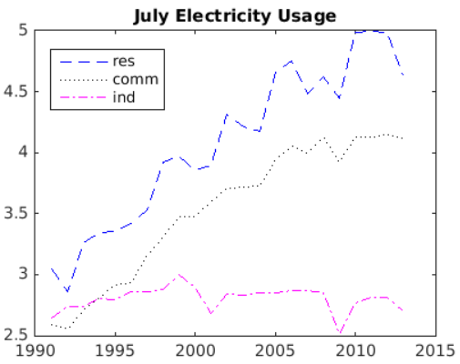
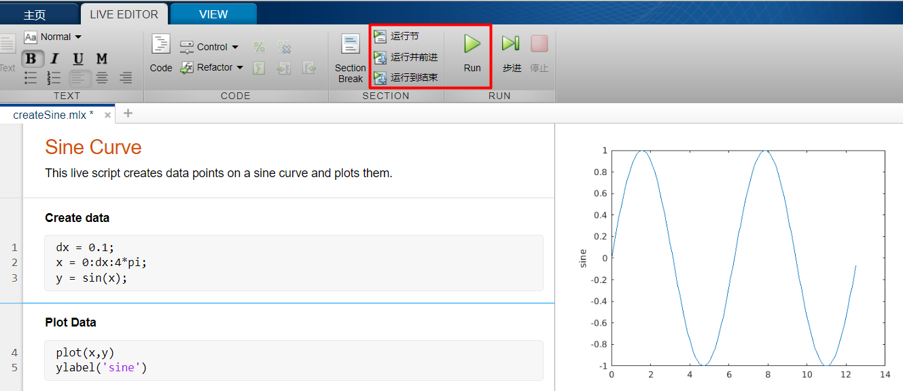

# matlab-common-operations

- clear - 清除所有变量


- clc - 清理命令行窗口


#### 1. **使用内置的函数和常量**

- MATLAB 包含内置的常量，例如 `pi` 表示 π。
- MATLAB 包含许多内置的函数，例如 `abs`（计算绝对值）和 `eig`（计算特征值）。
- 使用 `sqrt` 函数计算 `-9` 的平方根。将结果赋给一个名为 `z` 的变量：`z = sqrt(-9)`

#### 2. **数组**

- 所有 MATLAB 变量都是数组，这意味着每个变量均可以包含多个元素。单个称为标量的数值实际上是一个 1×1 数组，也即它包含 1 行 1 列。
- 可以使用方括号创建包含多个元素的数组：`x = [3 5]`
- 当您用空格（或逗号）分隔数值时，MATLAB 会将这些数值组合为一个行向量，行向量是一个包含一行多列的数组 (1×*n*)。当您用分号分隔数值时，MATLAB 会创建一个列向量 (*n*×1)。
- 在 MATLAB 中，您可以在方括号内执行计算。` x = [abs(-4) 4^2]` `x = [sqrt(10) pi^2]`
- 

#### 3. **创建等间距向量**

- 创建等间距向量：使用 `:` 运算符并仅指定起始值和最终值：`*first*:*last*` `y = 5:8`
- `:` 运算符使用默认的间距 `1`，但是您可以指定您自己的间距：`x = 20:2:26`
- 如果您知道向量中所需的元素数目（而不是每个元素之间的间距），则可以改用 `linspace` 函数：`linspace(*first*,*last*,*number_of_elements*)`。 `x = linspace(1,10,5)`
- `linspace` 和 `:` 运算符都可创建行向量。但是，您可以使用转置运算符 (`'`) 将行向量转换为列向量。`x = x'`
- 您可以通过在一条命令中创建行向量并将其全部转置来创建列向量。注意此处使用圆括号来指定运算的顺序。`x = (1:2:5)'`


#### 4. **数组创建函数**

- MATLAB 包含许多函数，可帮助您创建常用的矩阵，例如随机数矩阵。`x = rand(2)`
- 许多矩阵创建函数允许您输入一个数值来创建方阵 (n×n)，或者输入两个数值来创建非方阵。`x = rand(2,3)`
- 使用 `zeros` 函数创建一个包含 `6` 行 `3` 列 (6×3) 的全零矩阵。将结果赋给名为 `x` 的变量。`x = zeros(6,3)`


#### 5. **保存和加载变量**

- 使用 `save` 命令将工作区中的变量保存到称为 MAT 文件的 MATLAB 特定格式文件中。`save foo x`
- 将工作区变量 `data` 保存到一个名为 `datafile.mat` 的文件中。 `save datafile data`
- 使用 `load` 命令从 MAT 文件加载变量。`load foo`
- 从文件 `datafile.mat` 加载变量。`load datafile`


#### 6. **对数组进行索引**

- 您可以使用行、列索引从数组中提取值。`x = A(5,7)`
- 试着使用 `end` 关键字获取变量 `data` 的最后一行第三列的值。将该值赋给一个名为 `v` 的变量。`v = data(end,3)`
- 您可以将算术运算与关键字 `end` 结合使用。例如：`x = A(end-1,end-2)`


#### 7. **提取多个元素**

- 用作索引时，冒号运算符 (`:`) 可指代该维度中的所有元素。
- 创建一个名为 `density` 的变量，其中包含名为 `data` 的矩阵中第 2 列上的所有元素。`density = data(:,2)`
- 冒号运算符可以引用某个值范围。
- 试着创建一个名为 `volumes` 的变量，其中包含 `data`的最后两列的所有元素。`volumes = data(:,3:4)`
- 单个索引值可用于引用向量元素。`x = v(3)`
- 单个索引值范围可用于引用向量元素的子集。`x = v(3:end)`


#### 8. **更改数组中的值**

- 可以使用 `:` 字符来提取整列数据。
- 创建一个名为 `v2` 并且包含 `data` 的最后一列元素的向量。`v2 = data(:,end)`
- 可以通过组合使用索引与赋值来修改变量的元素。`A(2,5) = 11`


#### 9. **执行数组运算**

- 可以将一个标量值与数组中的所有元素相加。`y = x + 2`
- 可以将任意两个大小相同的数组相加。`z = x + y`
- 可以将数组中的所有元素与某个标量相乘或相除。 `z = 2*x` `y = x/3`
- MATLAB 中的基本统计函数可应用于某个向量以生成单个输出。可以使用 `max` 函数来确定向量的最大值。 `xMax = max(x)`
- MATLAB 的函数可在单个命令中对整个向量或值数组执行数学运算。 `xSqrt = sqrt(x)`
- 使用 `round` 函数创建一个名为 `vr` 的变量，其中包含四舍五入为整数的平均体积 `va`。`vr = round(va)`
- `*` 运算符执行[矩阵乘法](http://www.mathworks.com/help/matlab/ref/mtimes.html)，而 `.*` 运算符执行按元素乘法，允许您将两个大小相同的数组的对应元素相乘。


#### 10. **从函数调用获取多个输出**

- `size` 函数可以应用于数组，以生成包含数组大小的单个输出变量。`s = size(x)`
- `size` 函数可以应用于矩阵，以生成单个输出变量或两个输出变量。使用方括号[]获取多个输出。`[xrow,xcol] = size(x)`
- 可以使用 `max` 函数确定向量的最大值及其对应的索引值。`max` 函数的第一个输出为输入向量的最大值。执行带两个输出的调用时，第二个输出为索引值。`[xMax,idx] = max(x)`

#### 11. **获取帮助**

- 您可以输入`doc fcnName`以获取任何 MATLAB 函数的相关信息。
- 输入命令 `doc randi` 以打开 `randi` 函数的文档页。文档页将在一个新的浏览器标签页中打开。`doc randi`
- MATLAB 文档包含许多有用的示例和信息，可帮助您自行处理问题。
- 参考 `randi`[文档](https://www.mathworks.com/help/matlab/ref/randi.html)创建一个名为  的矩阵， 的完成以下任务。x其中包含 1 到 20 范围的随机整数；行数为 5；列数为 7。`x = randi(20,5,7)`

#### 12. **绘制向量图**

- 可以使用 `plot` 函数在一张图上绘制两个相同长度的向量。`plot(x,y)`
- `plot` 函数接受一个附加参数，该参数让您能够在单引号中使用各种符号来指定颜色、线型和标记样式。`plot(x,y,'r--o')`。以上命令将会绘制一条红色 (`r`) 虚线 (`--`)，并使用圆圈 (`o`) 作为标记。
- 您可以在[线条设定](http://www.mathworks.com/help/matlab/ref/linespec.html)的文档中了解有关可用符号的详细信息。
- 试着绘制 `mass2`（y 轴）对 `sample`（x 轴）的图。在绘图中使用红色 (`r`) 星号 (`*`) 标记，并且不使用线条。`plot(sample,mass2,'r*')`
- 您会注意到，最开始创建的绘图消失了。要在一张图上先后绘制两条线，请使用 `hold on` 命令保留之前的绘图，然后添加另一条线。您也可以使用 `hold off` 命令返回到默认行为。
- 绘制 `mass1`（y 轴）对 `sample`（x 轴）的图，并带有黑色 (`k`) 方形 (`s`) 标记，不带线条。 `plot(sample,mass1,'ks')`
- 输入 `close all` 命令以关闭所有打开的图窗窗口。
- 当您单独绘制一个向量时，MATLAB 会使用向量值作为 y 轴数据，并将 x 轴数据的范围设置为从 `1` 到 `n`（向量中的元素数目）。`plot(v1)`
- `plot` 函数接受可选的附加输入，这些输入由一个属性名称和一个关联的值组成。`plot(y,'LineWidth',5)`以上命令将绘制一条粗线。您可以在 [Line 属性](https://www.mathworks.com/help/matlab/ref/matlab.graphics.chart.primitive.line-properties.html)文档中了解更多可用属性的详细信息。
- 现在，试着绘制 `v1`，线宽为 `3`。`plot(v1,'LineWidth',3)`
- 使用 `plot` 函数时，您可在绘图参数和线条设定符之后添加属性名称-属性值对组。`plot(x,y,'ro-','LineWidth',5)`
- 绘制 `v1`（y 轴）对 `sample`（x 轴）的图，使用红色 (`r`) 圆圈 (`o`) 标记，线宽为 `4`。`plot(sample,v1,'ro-','LineWidth',4)`


#### 13. **编写绘图注释**

- 可以使用绘图注释函数（例如 `title`）在绘图中添加标签。这些函数的输入是一个字符串。MATLAB 中的字符串是用单引号 (`'`) 引起来的。`title('Plot Title')`
- 为现有绘图添加标题 `'Sample Densities'`。`title('Sample Densities')`
- 使用 `ylabel` 函数添加标签 `'Density (g/cm^3)'`。 `ylabel('Density (g/cm^3)')`

#### 14. **项目 - 用电量**

在此项目中，您将绘制各经济部门的用电量图 - 居民用电、商业用电和工业用电。您认为哪个经济部门的用电量将是最大的？




1. 用电量数据存储在一个名为 `electricity.mat` 的文件中。使用 `load` 将该数据导入 MATLAB。`load electricity` (右侧Workspace出现prices和usage的23*3 double)
2. 在命令提示符下输入 `usage` 以查看 `usage` 中的值。`usage`
3. `usage` 变量中有一个元素的值为 `NaN`。将该值替换为 `2.74`。`usage(2,3) = 2.74`
4. 居民数据存储在第一列中。创建一个变量 `res`，其中包含 `usage` 的第一列数据。`res = usage(:,1);`
5. 商业数据存储在第二列中。创建一个变量 `comm`，表示 `usage` 的第二列。`comm = usage(:,2);`
6. 工业数据存储在第三列中。创建一个变量 `ind`，其中包含 `usage` 的第三列数据。`ind = usage(:,3);`
7. 本示例使用的是从 1991 年到 2013 年收集的年用电量数据。通过创建的 `yrs` 变量可以在一个有意义的范围内绘制数据图。创建一个名为 `yrs` 的列向量，表示从 1991 年开始到 2013 年结束的年份。`yrs = (1991:2013)';`
8. 使用蓝色 (`b`) 虚线 (`--`) 绘制 `res`（y 轴）对 `yrs`（x 轴）的图。`plot(yrs,res,'b--')`
9. 输入 `hold on` 命令，以便您能够在现有绘图中添加另一条线。`hold on`
10. 使用黑色 (`k`) 点线 (`:`) 绘制 `comm`（y 轴）对 `yrs`（x 轴）的图。`plot(yrs,comm,'k:')`
11. 使用品红色 (`m`) 点划线 (`-.`) 绘制 `ind`（y 轴）对 `yrs`（x 轴）的图。`plot(yrs,ind,'m-.')`
12. 在现有绘图上添加标题 `'July Electricity Usage'`。 `title('July Electricity Usage')`
13. 在现有绘图上添加图例值 `'res'`、`'comm'` 和 `'ind'`。`legend('res','comm','ind')`
14. **完成！**从图中可以很明显地看出，工业部门的用电量相当稳定，波动似乎不如居民部门和商业部门的大。

#### 15. **项目 - 音频频率**

音频信号通常由许多不同的频率组成。例如，在音乐中，音符“中音 C”的频率为 261.6 Hz，并且大多数音乐都包含多个同时演奏的音符（或频率）。

一般情况下，构成信号的各个频率相差会足够大，使得它们相互之间不会有实质性的干扰。

但是，当信号包含两个非常接近的频率时，它们会使信号产生“拍频” - 振幅上的脉冲。


在此项目中，您将创建一个包含该拍频现象的信号，然后分析该信号的频率内容。

1. `fs` 将表示音频信号的采样频率。首先，创建一个名为 `fs` 的变量，其值为 `10`。 `fs = 10;`

2. `t` 将表示音频信号的采样时间。记住您可以使用分号 (`;`) 来抑制命令的输出，以防止命令行窗口混乱。创建一个名为 `t` 的向量，该向量以 `0` 开头，以 `20` 结尾，并且其元素之间的间距为 `1/fs`。 `t = 0:1/fs:20;`

3. `y` 表示每个采样时刻的音频信号幅值。创建一个名为 `y` 的变量，表示两个正弦波形之和：sin(1.8*2π*t*) + sin(2.1*2π*t*)。 `y = sin(1.8*2*pi*t) + sin(2.1*2*pi*t);`

4. 由于 `y` 向量是两个频率类似的正弦波之和，因此您会看到一种“拍频”现象。绘制 `y` 向量（y 轴）对 `t` 向量（x 轴）的图。`plot(t,y)`

5. 傅里叶变换返回信号的频率信息。您可以使用 `fft` 函数来计算向量的离散傅里叶变换。`fft(y)`。创建一个名为 `yfft` 的变量，表示 `y` 的离散傅里叶变换。`yfft = fft(y);`

6. 使用 `numel` 函数返回数组中的元素数目。创建一个名为 `n` 的变量，表示 `y` 中的元素数目。`n = numel(y);`

7. MATLAB 中的 `fft` 函数只使用采样数据计算傅里叶变换。`f` 变量表示与 `yfft` 中的值对应的频率。创建一个名为 `f` 的变量，表示一个向量，该向量以 `0`开头，以 `fs*(n-1)/n` 结尾，并且其元素之间的间距为 `fs/n`。`f = 0:fs/n:fs*(n-1)/n;`

8. `fft` 的输出值为复数。要绘制它们的模（幅值），您可以使用您可以使用 `abs` 函数。绘制表达式 `abs(yfft)`（y 轴）对 `f`（x 轴）的图。`plot(f,abs(yfft))`

9.   **完成！**请注意绘图左侧的两个峰值，这两个峰值与您先前创建的两个正弦波形的频率对应。由于这些峰值非常接近，因此信号会呈现出拍频现象。

   为什么有四个峰值？这与奈奎斯特频率有关，在此示例中该频率为 `5`（即 `fs/2`）。当输入向量包含实数时，`fft` 函数始终会返回其其幅值关于奈奎斯特频率对称的数据。也就是说，绘图的后一半（在奈奎斯特频率之后）正好是前一半的镜像。  

#### 16. **MATLAB编辑器**

- 所显示的实时脚本可绘制从 0 到 2π 的正弦波形。试着修改该实时脚本，以便绘制 0 到 4π 范围内的正弦波形。

  

- 现在，使用 `xlabel` 函数将标签 `'radians'` 添加到绘图的 x 轴。`xlabel('radians')`


- [关系运算符](https://www.mathworks.com/help/matlab/matlab_prog/array-comparison-with-relational-operators.html)（例如 `>`、`<`、`==` 和 `~=`）执行两个值之间的比较。相等或不相等比较的结果为 1 (true) 或 0 (false)。
- 使用关系运算符 `>` 测试 π 是否大于 `3`。`pi > 3`
- 再次测试 π 是否大于 `3`，但这一次将输出赋给一个名为 `test` 的变量。`test = pi > 3`
- 您可以使用关系运算符将某个向量或矩阵与单个标量值进行比较。结果是与原始数组相同大小的逻辑数组。`[5 10 15] > 12      ans =  0    0    1`
- 试着创建一个表示测试结果的变量 `x`，测试 `v1` 的每个元素是否大于 `5` 的输出。`x = v1 > 5`
- 可以使用关系运算符对两个数组的对应元素进行比较。这两个数组的大小必须相同，其比较结果是与这两个数组具有相同大小的逻辑数组。[5 10 15] > [6 9 20]
- 试着创建一个表示测试结果的变量 `y` 的变量，测试 `v1` 的每个元素是否大于 `v2` 中的对应元素。`y = v1 > v2`
- **完成！**您可能已注意到，就像数值运算符一样，逻辑运算符也会被向量化。


#### 18. **组合逻辑条件**

- MATLAB 包含 AND (`&`) 和 OR (`|`) 等逻辑运算符，可将多个逻辑条件组合在一起。如果两个元素都为 `true`，`&` 运算符将返回 `true` (`1`)，否则返回 `false` (`0`)。例如：`x = (pi > 5) & (0 < 6)`
- 试着创建一个表示测试结果的变量 `test`，测试 π 大于 `3` 和 `x` 大于 `0.9` 是否同时成立。`test = (pi > 3) & (x > 0.9)`
- 试着创建一个名为 `vt` 的逻辑数组。数组 `vt` 中的元素在 `v1` 大于 `5` 且 `v1` 大于 `v2` 时为 `true`。`vt = (v1 > 5) & (v1 > v2)`


#### 19. **逻辑索引**

- 您可以使用逻辑数组作为数组索引，在这种情况下，MATLAB 会提取索引为 `true` 的数组元素。以下示例将会提取 `v1` 中大于 6 的所有元素。`v = v1(v1 > 6)`
- 试着创建一个名为 `v` 的变量，其中包含 `v1` 中所有小于 4 的元素。`v = v1(v1 < 4)`
- 试着创建一个名为 `s` 的变量，其中包含 `sample` 中与 `v1` 中小于 `4` 的元素所在位置对应的元素。`s = sample(v1 < 4)`
- 您可以使用逻辑索引在数组中重新赋值。例如，如果您要将数组 `x` 中等于 `999` 的所有值都替换为 `0`，请使用以下语法。`x(x==999) = 0`
- 试着修改 `v1`，将其中大于 `5` 的所有值都替换 `10`。`v1(v1>5) = 10`


#### 20. **决策分支**

- 有时，您可能想在仅满足某一条件时才执行某个代码段。您可以使用 `if` 语句完成该操作。每个 `if` 语句都必须包含一个 `if` 关键字和一个 `end` 关键字，只有满足条件时，才会执行 `if` 和 `end` 关键字之间的代码。

  ```matlab
  x = rand;
  if x > 0.5
      y = 3; %只有 x > 0.5 才会执行
  end
  ```

- 通常，您可能还希望在所设条件不成立时执行其他代码。为此，您可以使用 `else` 关键字，如下所示。

  ```matlab
  x = rand;
  if x > 0.5
      y = 3;
  else
      y = 4;
  end
  ```

#### 21. **For 循环**

- 常见的编程任务是重复执行某个代码段。在 MATLAB 中，您可以使用 `for` 循环完成该操作。

  ```matlab
  for i = 1:3
      disp(i)
  end
  ```

  请注意，`for` 循环包含单个 `end` 关键字，与 `if` 语句类似。

  运行此代码时，`for` 和 `end` 关键字之间的代码在该示例中将被执行三次，因为循环计数器 (`i`) 通过 `1:3`（`1`、`2` 和 `3`）进行计数。  

-   以循环方式包装实时脚本 `forLoop.mlx` 中的 `disp` 函数，执行 `5` 次。首次循环时，`idx` 的值应为 `1`，并且每次迭代时递增 `1`。  

  ```matlab
  x = (11:15).^2;
  for idx = 1:5
      disp(x(idx))
  end
  ```

 #### 22. **项目 - 恒星运动**

1. `spectra` 数据是在均匀间隔的波长上收集的，起始波长值 (λ*start*)、间隔大小 (λ*delta*) 和观测值个数是已知的。
2. 创建一个名为 `lambdaEnd` (λ*end*) 的变量，表示所记录光谱中的最后一个波长值。您可以通过方程 λ*end* = λ*start* + (*nObs*-1)λ*delta* 来计算 `lambdaEnd`。`lambdaEnd = lambdaStart + (nObs-1)*lambdaDelta;`
3. 冒号 (`:`) 运算符可创建具有固定步长的行向量。使用转置运算符 (`'`) 将行变成列。
4. 创建一个名为 `lambda` (λ) 的列向量，表示频谱中的波长，范围从 λ*start* 到 λ*end*，步长为 λ*delta*。`lambda = (lambdaStart:lambdaDelta:lambdaEnd)';`
5. `spectra` 的每一列分别对应不同恒星的光谱。第六列是恒星 HD 94028 的光谱。将 `spectra` 的第六列提取到一个名为 `s` 的向量。`s = spectra(:,6);`
6. 使用 `loglog` 函数（用法同 `plot` 函数），在两个坐标轴上使用对数刻度。将光谱 (`s`) 作为波长 (`lambda`) 的函数进行绘图，在两个坐标轴上使用对数刻度。使用点标记 (`.`) 并用实线 (`-`) 连接各点。`loglog(lambda,s,'.-')`
7. `min` 函数可以带有两个输出，其中第二个输出为最小值的索引。该索引与氢-α 谱线的位置对应。创建两个变量 `sHa` 和 `idx`，分别表示 `s` 的最小值和最小值的位置索引。`[sHa,idx] = min(s)`
8. 使用 `idx` 对 `lambda` 进行索引，找到氢-α 谱线的波长。将结果存储为 `lambdaHa` (λ*Ha*)。`lambdaHa = lambda(idx)`
9. **完成！**您已确定 HD 94028 的氢-α 谱线的波长为 656.62 nm，该波长略长于实验值 656.28 nm。在下一节中，您将使用该波长来确定恒星对地球的相对速度。


#### 23. **项目 - 恒星运动（脚本）**

1. 实时脚本 `findRedShift` 会执行上一节中的步骤来计算氢-α 波长。

   在 `findRedShift.mlx` 中添加代码，以在光谱绘图中标示氢-α 谱线的位置。在脚本相应位置进行编辑，将 x = `lambdaHa`、y = `sHa` 处的单个点绘制成一个大小 (`'MarkerSize'`) 为 `8` 的红色方框 (`'rs'`)，并**添加到现有图**。

   ```matlab
   % Stellar Motion
   % Determine a star's motion by calculating the redshift in its spectrum, using the Hydrogen-alpha () line.
   
   %% Load data and define measurement parameters
   load starData
   nObs = size(spectra,1);
   lambdaStart = 630.02;
   lambdaDelta = 0.14;
   
   %% Create vector of wavelengths
   % Calculate last wavelength
   lambdaEnd = lambdaStart + (nObs-1)*lambdaDelta;
   % Make column vector of equally spaced wavelengths
   lambda = (lambdaStart:lambdaDelta:lambdaEnd)';
   
   %% Extract spectrum of HD94028
   % Extract the appropriate column of spectra
   s = spectra(:,6);
   
   %% Plot the spectrum
   loglog(lambda,s,'.-')
   xlabel('Wavelength')
   ylabel('Intensity')
   
   %% Find the wavelength of the Hydrogen-alpha line
   % Find the location of the minimum spectral value
   [sHa,idx] = min(s);
   % Extract the corresponding wavelength
   lambdaHa = lambda(idx);
   
   %% Show the Hydrogen-alpha line on the spectrum plot
   % Task 1: Add to the existing graph by plotting the single point  = lambdaHa,  = sHa as a red square ('rs') with a marker size ('MarkerSize') of 8.
   hold on
   loglog(lambdaHa,sHa,'rs','MarkerSize',8)
   hold off
   ```

2. 实时脚本 `findRedShift` 会找到恒星的氢-α 波长。在该脚本中，您可以使用公式 z = (λ*Ha* / 656.28) - 1 计算红移量。然后，只需将红移量与光速 (299792.458 km/s) 相乘，就可以计算速度。

   在 `findRedShift.mlx` 中添加代码，以计算红移量以及恒星远离地球的速度 (km/s)。将红移量保存为变量 `z` 的变量中，将速度保存为变量 `speed`。

   ```matlab
   %% Determine the redshift
   % Task 2 (a): Calculate the redshift factor using the formula
   z = lambdaHa/656.28 - 1;
   
   %% Determine the stellar motion
   % Task 2 (b): Calculate the rate that the star is moving away from the Earth (in km/s) using the formula
   speed = z*299792.458;
   ```

3. 创建用于计算红移的实时脚本之后，您可以非常方便地修改脚本，并对 `spectra` 矩阵中的任何恒星执行同样的计算。

   修改 `findRedShift.mlx` 中的代码，计算 `spectra`中的第二个恒星（而不是第六个）的红移。

   ```matlab
   s = spectra(:,2);
   ```

4. **完成！**使用 MATLAB 脚本，您可以很方便地计算数据集中任何恒星的红移。您可以对收集到的数据集中的所有恒星执行同样的操作。现在，您已经通过计算光谱强度 (s) 的最小值得到了恒星的氢-α 波长。不过，对于某些恒星，氢-α 谱线会出现在最大强度值处，而不是最小强度值处。因此，更可靠的方法是计算与异常值的最大偏差，其中异常值定义为 s和 mean(s) 差的绝对值。


